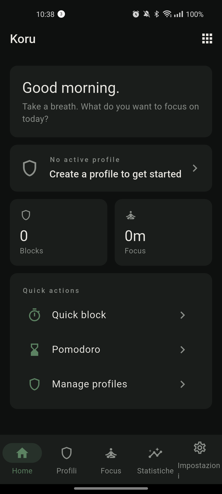
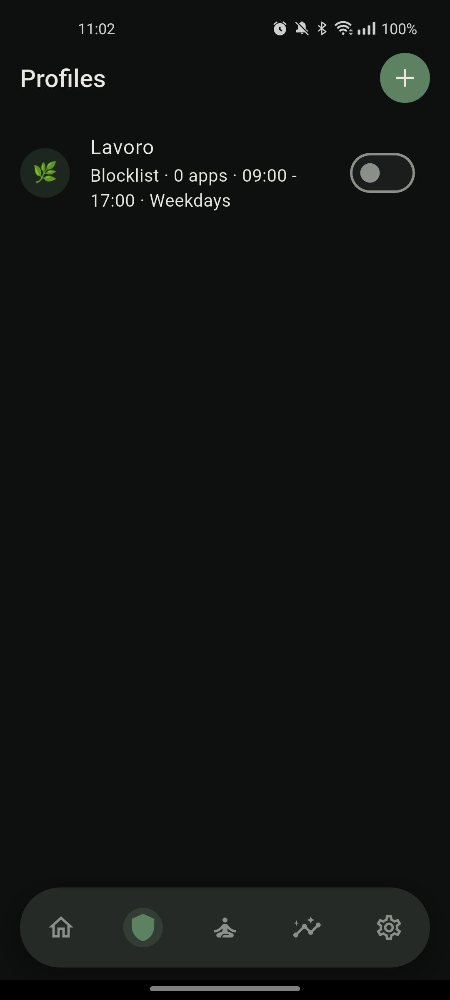
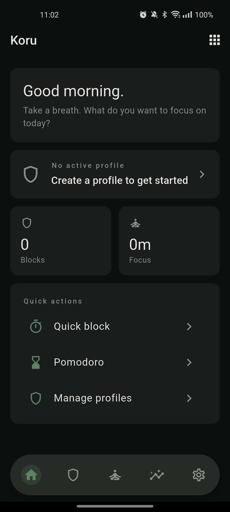
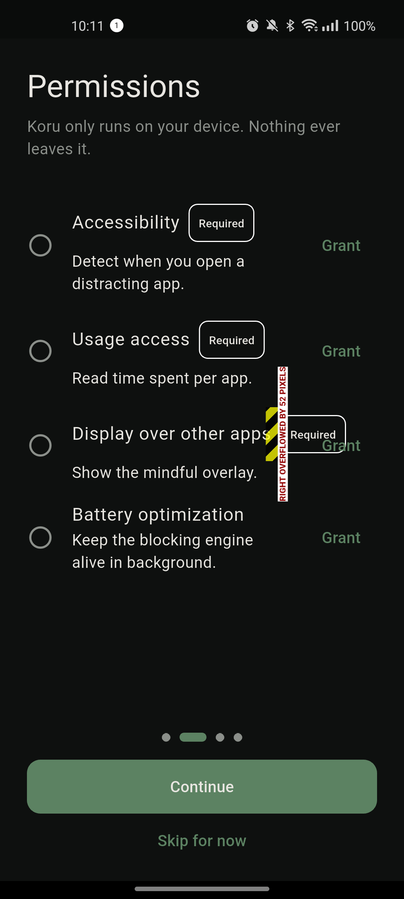

# Koru

> A minimalist Android launcher and mindful app blocker, built to give you
> back the most expensive thing you own — your attention.

**Koru** (Māori, the unfurling spiral of the silver fern frond — a symbol of
new life and inner growth) replaces the busy, dopamine-driven home screen
of a modern phone with something quieter: a clock, the apps you actually
want, and a soft layer of friction in front of the ones you don't.

It's not a productivity timer. It's not an app that yells at you. It's a
small change to the surface of your phone that makes the next compulsive
unlock just a little harder, and the next intentional one just a little
easier.

<p align="center">
  
</p>

---

## Why

The average phone is engineered to be picked up 80+ times a day. Most apps
on it are engineered to keep you there once you arrive. Koru takes the
opposite stance: every screen is designed to push you *out* of the phone
once you've done what you came to do.

Instead of generic screen-time limits buried three menus deep, Koru lets
you build **profiles** — context-aware rules that say *"between 9 and 17
on weekdays, Instagram is closed, and if I try to open it I have to wait
10 seconds and write a reason."* The profile turns itself on and off
without you having to think about it.

## What's inside

### A launcher that gets out of the way

- **Round analog-style home** with a battery ring around the clock, weather
  glance, and the date.
- **A–Z app drawer** with a haptic fast-scroller and search.
- **Reorderable favorites** so the four or five apps you actually use are
  one tap away — everything else is one swipe further.
- **No icons, no ads, no notification bubbles, no widgets you didn't ask
  for.**

### Mindful blocking, not punitive blocking

- **Profiles** combine four conditions with bitmask logic:
  *time window* + *day of week* + *daily usage limit* + *manual toggle*.
  A profile fires when its conditions match — no global on/off switch
  needed.
- **Blocklist or allowlist** per profile. Block five apps, or allow only
  three.
- **Per-app overlay designer.** For each (app × profile) pair you choose
  the overlay background color, the message ("Is this worth your next
  ten minutes?"), the countdown length, and what bypass behavior — if
  any — you allow.
- **Mindful intentions.** Before unlocking a blocked app you pick a
  reason from a short list ("checking a message", "looking something up",
  "just curious"). The reason is logged. Over a week you can see your own
  patterns.

<p align="center">
  
</p>

### In-app content blocking

Sometimes you don't want to block *Instagram* — you want to block the
**Reels** tab and leave DMs alone. Koru detects in-app sections using
the Accessibility service and hides the parts of the UI that pull you in:

- Instagram **Reels**, **Stories**, **Explore**
- YouTube **Shorts**
- Configurable per profile

### Browser URL blocking

Blocks distracting domains across **40+ browsers** (Chrome, Firefox, Brave,
Samsung Internet, Opera, Edge, DuckDuckGo, Vivaldi, Kiwi, Mi Browser…) by
reading the URL bar through the Accessibility service. No DNS hack, no VPN,
no certificate install — and it works inside private/incognito tabs.

### Focus tools

- **Quick Block** — pick a duration, lock everything that isn't on a
  short whitelist.
- **Pomodoro** — 25/5 (or custom) work-break cycles backed by a
  persistent foreground service, so the timer survives task-killers,
  app swipes, and Doze.

### Strict Mode (the "I really mean it" switch)

For when you know you'll try to wriggle out:

- Makes the Settings app, Recent Apps, and Koru's own uninstall flow
  *harder to reach*, using Android **Device Admin** + Accessibility
  interception. It is a deterrent, not an unbreakable lock — a motivated
  user can still remove it (e.g. via `adb`, or if Android revokes the
  Accessibility permission). See [SECURITY.md](SECURITY.md) for the
  honest threat model.
- The bypass code rotates **weekly** and is shown only after a cooling-off
  period — so disabling Koru in a moment of weakness takes long enough
  for the impulse to pass.
- Emergency backdoor available, but deliberately friction-heavy.

### Dashboard

<p align="center">
  
</p>

A weekly view of:

- **Interventions** — how many times an overlay caught you
- **Skipped blocks** — how many times you bypassed (and why)
- **Focus minutes** — time spent inside Pomodoro / Quick Block
- **Top distractions** and **top intentions** of the week
- An optional **daily mood check-in**

### Three ready-made presets

For people who don't want to design profiles from scratch, three are
shipped in `assets/presets/`:

- **Mindful Morning** — social apps locked until 09:00
- **Deep Work** — distractors blocked weekdays 09:00 – 17:00
- **No Screen Evening** — everything except phone, maps, and music
  closes at 21:00

---

## How it works

Koru is a **Flutter app with a substantial Kotlin native layer**. The
UI, persistence, and orchestration are in Dart; the parts that need
deep Android integration are in Kotlin and talk to Flutter through
`MethodChannel` / `EventChannel`.

```
lib/                                Dart side
├── core/         theme, router, DI, constants
├── data/         Drift (SQLite, 21 tables) + Hive (KV)
├── domain/       entities, use-cases
├── platform/     facades over MethodChannels
└── presentation/ Riverpod providers, screens, widgets

android/app/src/main/kotlin/com/dev/koru/   Kotlin side
├── service/      AccessibilityService + foreground blocking engine
├── browser/      URL extraction across 40+ browsers
├── content/      Instagram / YouTube in-app section detection
├── strictmode/   Device Admin enforcer + rotating backdoor codes
├── notification/ NotificationListener filter
└── channels/     5 MethodChannel + EventChannel bridges
```

The blocking engine is event-driven (Accessibility events), with a
foreground-service polling loop as a backup for OEMs that throttle
Accessibility. Cross-process state (Quick Block, usage counters,
notification filters) is stored in file-backed stores readable from the
`:accessibility` process, so the overlay can decide what to do without
waking the main Flutter isolate.

## Tech stack

- **Flutter 3.41 / Dart 3.11**
- **Riverpod 2.6** — state management
- **GoRouter 14.8** — navigation
- **Drift 2.22** — typed SQLite
- **hive_ce 2.10** — fast KV storage
- **fl_chart 0.70** — analytics charts
- **Jetpack Compose** — native overlay UI
- **AndroidX Security Crypto** — Keystore-backed encrypted prefs for
  Strict Mode state

## Build

Requires Flutter 3.41+, JDK 17, Android SDK 36.

```bash
flutter pub get
dart run build_runner build --delete-conflicting-outputs
flutter build apk --debug
```

Install with `flutter install`, then walk through the onboarding —
Koru will ask you to grant Accessibility, Usage Access, Display-over-other-apps,
and (optionally) Battery Optimization exemption.

<p align="center">
  
</p>

## Privacy

Everything Koru does happens on-device.

- **No account.** No sign-up, no email, no cloud.
- **No analytics, no telemetry, no crash reporters.**
- **No network calls** other than the system-level ones Android itself
  makes (you'll see `INTERNET` in the manifest only because some
  third-party plugins request it transitively — Koru itself does not
  open sockets).
- **No ads, ever.** The minimalist launcher and core blocking are free
  and open source. An optional one-time **Koru Pro** unlock (advanced
  blocking depth, unlimited profiles, long-term stats, personalization)
  funds development — no subscriptions, no data ever sold.

Your blocklists, your overlays, your intentions, your mood check-ins:
all of it lives in a SQLite file and a few Hive boxes inside the app's
private storage. Uninstall the app and it is gone.

## Support

Locked out by Strict Mode, or blocking stopped working? See
[SUPPORT.md](SUPPORT.md) for recovery steps (backdoor code, and how to
uninstall via system settings or `adb` if Accessibility is off).

## License

Licensed under the **Apache License, Version 2.0**.

```
Copyright 2026 Matteo Preda

Licensed under the Apache License, Version 2.0 (the "License");
you may not use this file except in compliance with the License.
You may obtain a copy of the License at

    http://www.apache.org/licenses/LICENSE-2.0

Unless required by applicable law or agreed to in writing, software
distributed under the License is distributed on an "AS IS" BASIS,
WITHOUT WARRANTIES OR CONDITIONS OF ANY KIND, either express or implied.
See the License for the specific language governing permissions and
limitations under the License.
```
